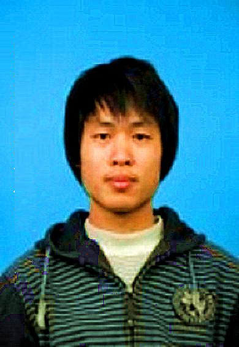

<a href="#" onclick="printResume()">打印</a> <a href="./assets/resume/简历-许俊富-上海大学.docx">下载word格式</a> <a href="./assets/resume/简历-许俊富-上海大学.pdf">下载PDF格式</a>

---

### 联系方式

- 手机：15216716786 
- Email：<a href="mailto:xjf891121@gmail.com">xjf891121@gmail.com</a>
- QQ/微信号：402077243

---

### 个人信息

 - 许俊富/男/1989 
 - 研究生/上海大学计算机系
 - 籍贯：湖北省黄石市 
 - 通信地址：上海市宝山区上大路99号计算机楼
 - 微博：[@落世离歌](http://weibo.com/u/2438098050)
 - 技术博客：[http://junfuxu.github.io](http://junfuxu.github.io/)
 - Github: [https://github.com/JunFuXu](https://github.com/JunFuXu) 
 - 期望职位：Python高级程序员，C/C++ ， 数据分析
 - 期望薪资：税前20+W，特别喜欢的公司可例外
 - 期望城市：上海

---

### 专业技能

以下均为我熟练使用的技能

- 编程语言：		C/C++/Python/PHP	
- 数据库相关：		MySQL/SQL Server/MongoDB
- 工具软件：		Visual Studio/Git /Sublime 
- Linux技术:	    熟悉常用Linux命令
- 版本管理、文档和自动化部署工具：Git/Svn/Pip
- 常用库：	STL/Boost/Numpy/Scipy/Pandas/Matplotlib/PHPExcel
- 并行技术：	OpenMP/MPI/CUDA

---

## 实践经历

### 上海大学 （ 2013年9月 ~2015年9月）

#### 上海大学教工体检系统 
项目描述：与上海大学校医院合作，担任核心开发成员，负责并完成了数据管理(过滤清洗，导入进库，数据同步)模块。
项目总结： 参与团队合作开发，掌握PHP项目基于CodeIgniter框架开发技术；同时也让我更加熟练使用Git, workbench, 

#### 生物信息课题组网站建设 
独立完成生物信息课题组网站建设，方便课题组日常工作管理。让我对开发有着更加全部了解和认识。主要需求分析，功能模块化分，前后台对接。

#### 参与多个”微网站”的建设
微信的发展直接促进了目前企业用微信作为媒介进行宣传的模式。项目中将以往网站的经验应用于手机端，并对web前端开发有了新的认识。

#### 基于CUDA的生物序列数据算术编码并行压缩
项目描述：基于C++编程采用CUDA技术实现并行算术编码，分析并结合了生物序列数据特性，针对算术编码压缩进行优化。
项目总结：熟悉并行计算加速技术，学习编程优化技术。
职责：该健康管理平台主要是展示学生的就诊及体检数据，是校企合作项目。我负责其中3个小模块的实施，从沟通需求、编程到测试。
收获：了解并运用用户登录模块； 负责部分项目，有团队工作及项目管理经验；在此平台的基础上讨论数据分析方法。
  
#### 基于时间序列的游泳数据分析
项目描述：基于Python(numpy/scipy, Matplotlib)编程技术，使用聚类，SVM分类，回归分析和神经网络等等机器学习方法对游泳数据进行挖掘分析。
项目总结： 学习网络数据爬取技术；系统地学习机器学习方法，并运用于具体数据分析；完成了从数据爬取，预处理，特征选择，模型训练到预测；方法上，尝试对数据分析从简单一阶线性分析到多项式回归分析，高维线性分析，爬取线性分析及数据Granger因果分析。

### 上海岂安科技公司  (2015年11月 ~至今）
#### voip分类
通过sip协议，对手机号状态分类。参与这个项目当中语音截取，以及分类等等任务。

#### 日志中心
负责公司多个项目日志数据流向，如将日志数据打到elasticsearch，mysql等等当中，还参于日志数据分析和挖掘，学习了RPC技术。
	
#### 脚本自动化管理 
使用Celery分布式框架构建脚本自动化管理系统。该系统对公司所有脚本有着自动化管理功能，脚本远程调用和运行状态跟踪等等，学习了分布式任务调度技术。

---

#### 开源项目和作品

 - [Sudoku](https://github.com/JunFuXu/Sudoku) : 数独游戏自动求解：递归回溯自动求解9x9阶数独
 - [ArithmeticCoder](https://github.com/JunFuXu/ArithmeticCoder) : 基于CUDA的算术编码并行压缩：结合GPU的并行计算能力和算术编码的高效压缩技术快速完成数据压缩技术
 
---

### 所获荣誉

##### 研究生：
 * 2014-2014学年： 	校三等奖学奖。

##### 本科生：

* 2013-2013学年：    校奖学三等奖。
* 2012-2013学年：	全国“蓝桥杯“程序设计湖北区一等奖；
* 2012-2013学年：	全国“蓝桥杯“程序设计优秀奖；
* 2011-2012学年：	校数学竞赛三等奖；

---

### 技术文章

- [大数据分析技术：Computational Analysis of USA Swimming Data](./assets/resume/1406699654.pptx)
- [来自Andrew W. Moore的Gaussians分布 (翻译文章)](http://junfuxu.github.io/blog/guassian/)
- [Python工具分析风险数据](https://mp.weixin.qq.com/s?__biz=MzIxNDE4MzA4OQ==&mid=2651024546&idx=1&sn=c6c07df6cdd11a7a077e5b0e367bef9b&scene=1&srcid=0718xf85E4Ml7hibVGsxTvwa&pass_ticket=Kp4M3RUO7Y%2FFccIatx6fICtdOx9Qe7sGX53520kgHyhlaCgpIis1LJ3Utr%2FyPSCO#rd)

### 演讲和讲义

 - 2015HPCA会议演讲：[大数据分析技术：Computational Analysis of USA Swimming Data](./assets/resume/1406699654.pptx)
 - 上海大学生物信息课题组内部分享：[机器学习：关联规则挖掘](./assets/resume/1406699654.pptx)

---

### 自我评价

 * 对计算机科学充满兴趣，自学能力较强，目前主要做web开发及数据分析。
 * 积极乐观，乐于参与公益活动；工作中，态度认真，有责任心，具备良好的沟通能力。
 * 有着扎实的计算机理论基础，擅长多种软件、工具的使用；具有较强的数据分析，建模能力，有团队合作精神，热爱coding。

## 致谢

感谢您花时间阅读我的简历，期待能有机会和您共事。
